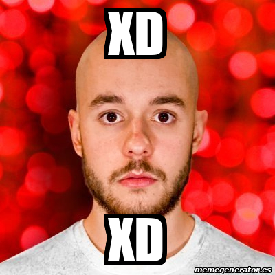

# Programacion en Lenguaje Interpretados

Bienvenidos al nuevo semestre, esta es la materia de **Programacion de lenguajes interpretados**, del tercer semestre de la carrera en **Ingenieria en desarrollo de Software Interactivo y Videojuegos** de _Amerike_

En este documento aprenderemos la sintaxis de lenguaje de marcado _**MarkDown**_, que hoy en dia es el estandar para escribir documentacion tecnica en el mundo de desarrollo de _Software_

En el siguiente [enlace](https://jonmircha.com/markdown), encontraras mas informacion sobre MarkDown


## Encabezado 2
### Encabezado 3
#### Encabezado 4
##### Encabezado 5
###### Encabezado 6


Este es un parrafo mas.

---

## Listas

### Lista Ordenadas

1. Primavera
1. Verano
1. Otoño
1. Invierno

### Listas Desordenadas

- Primavera
- Verano
- Otoño
- Invierno

### Sublistas

- Primavera
    - Marzo
    - Abril
    - Mayo
    - Junio
- Verano
    - Julio
    - Agosto
        - Regreso a clases
    - Septiembre
        - Fiestas Patrias
- Otoño
- Invierno

---

### Citas textuales

>Yo solo se que no se nada

>Yo solo se que no se nada
>
>Socrates

### Tablas

| Pais | Ciudad | Continente |
|-|-|-|
| Mexico | CDMX | America |
| Francia | Paris | Europa |
| Japon | Tokio | Asia |

### Codigo

``` JS
Function SUMAR(a,b){
    return a+b;
}
```

``` css
html {
    font-size: 16px;
    color: #fff;
    background-color: #fff;
}
```